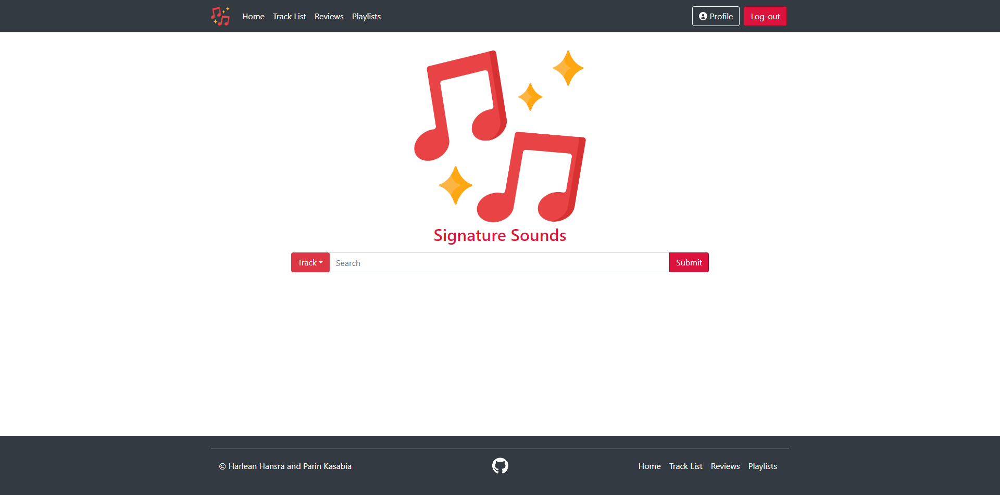

# Signature Sounds
Welcome to Signature sounds! This is a flask application that was made in 2022 by Parin Kasabia and Harlean Hansra for a Computer Science course at the University of auckland. The purpose of this application is to facilitate music lovers dreams by allowing them to find new tracks, leave reviews and add them to a dedicated playlist. (Note that this application is only a MVP, a proof of concept)


## Description

This repository contains an implementation of signature sounds, a web application built using the Flask framework. This application aims to build off the domainmodel designed in A1 and provide a MVP which allows users to browse tracks, add reviews, like tracks and create, alongside share playlists. 

## Installation

**Installation via requirements.txt**

```shell
$ py -3 -m venv venv
$ venv\Scripts\activate (Windows)
$ source venv/bin/activate (unix/linux)
$ pip install -r requirements.txt
```

When using PyCharm, set the virtual environment using 'File'->'Settings' and select your project from the left menu. Select 'Project Interpreter', click on the gearwheel button and select 'Add'. Click the 'Existing environment' radio button to select the virtual environment. 

## Execution

**Running the application**

From the project directory, and within the activated virtual environment (see *venv\Scripts\activate* above):

````shell
$ flask run
```` 


## Testing

After you have configured pytest as the testing tool for PyCharm (File - Settings - Tools - Python Integrated Tools - Testing), you can then run tests from within PyCharm by right clicking the tests folder and selecting "Run pytest in tests".

Alternatively, from a terminal in the root folder of the project, you can also call 'python -m pytest tests' to run all the tests. PyCharm also provides a built-in terminal, which uses the configured virtual environment. 

 
## Data sources

The data files are modified excerpts downloaded from:
https://www.loc.gov/item/2018655052  or
https://github.com/mdeff/fma 

We would like to acknowledge the authors of these papers for introducing the Free Music Archive (FMA), an open and easily accessible dataset of music collections: 

Defferrard, M., Benzi, K., Vandergheynst, P., & Bresson, X. (2017). FMA: A Dataset for Music Analysis. In 18th International Society for Music Information Retrieval Conference (ISMIR).

Defferrard, M., Mohanty, S., Carroll, S., & Salathe, M. (2018). Learning to Recognize Musical Genre from Audio. In The 2018 Web Conference Companion. ACM Press.
